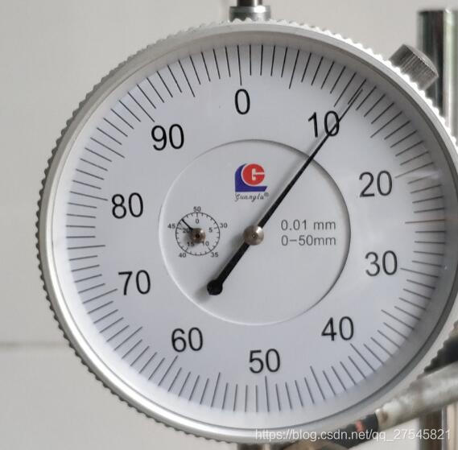

paddleocr环境搭建：
https://github.com/PaddlePaddle/PaddleOCR/blob/release/2.3/doc/doc_ch/environment.md

借助 PaddleHub，服务器端的部署也非常简单，直接用一条命令行在服务器启动文字识别OCR模型：

$ hub serving start -m chinese_ocr_db_crnn_mobile -p 8866

输入图片

返回 11.087137463172647

