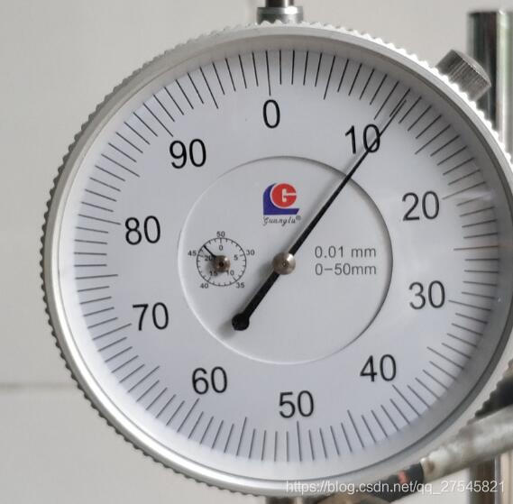

paddleocr环境搭建：
https://github.com/PaddlePaddle/PaddleOCR/blob/release/2.3/doc/doc_ch/environment.md

借助 PaddleHub，服务器端的部署也非常简单，直接用一条命令行在服务器启动文字识别OCR模型：

$ hub serving start -m chinese_ocr_db_crnn_mobile -p 8866

输入图片

返回 11.087137463172647

要使用弯曲/旋转数字检测，需要到github下载paddleocr项目，
放入sast模型det_r50_vd_sast_totaltext_v2.0_train，
把PaddleOCR/tools/infer下predict_det.py换成本项目的，
然后运行GetDetectBox.py

记得配环境，github上paddleocr里面的requirements.txt里，
这个环境和paddleocr api的包有版本冲突，可以多个终端解决，